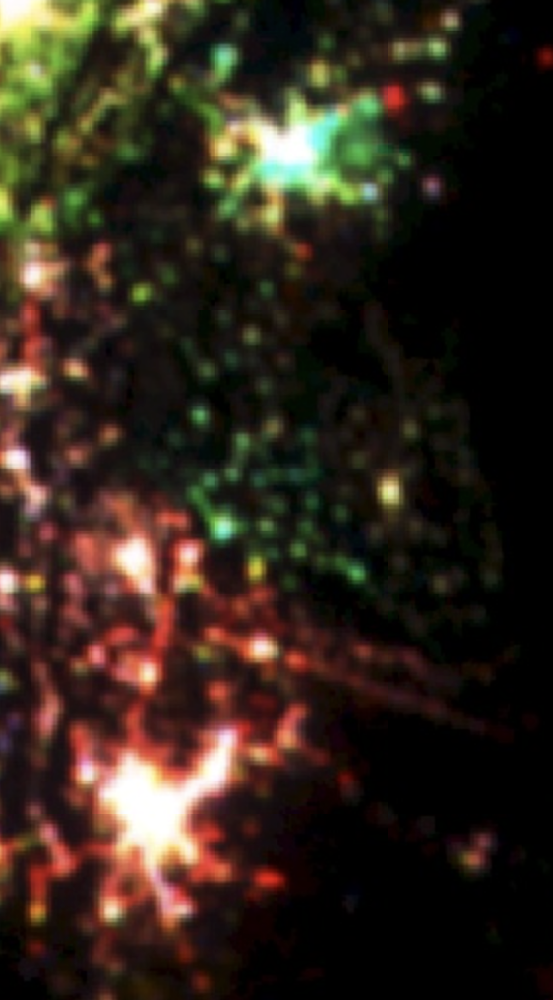

# Assignment questions for 2.2 synthesis.

### Assignment 1. Compare and contrast the changes in nighttime lights around Dam-
ascus, Syria versus Amman, Jordan. How are the colors for the two cities similar
and different? How do you interpret the differences?

In the damascus region (in the upper part of the attached image), the green pixels are brighter, suggesting that the region had more lights in 1993, as compared to 2003, and 2013. While for Amman, Jordan, the regions has more visisble lights, since it has more red pixels. 

### Assignment 2. Look at the changes in nighttime lights in the region of Port Har-court, Nigeria. What kinds of changes do you think these colors signify? What clues in the satellite basemap can you see to confirm your interpretation?

White pixels in the middle, which means that the center reagion was developed in 1993, 2003, and 2013, but it's red in the outskirts that means the development spread outwards. 

### Assignment 3. In the nighttime lights’ change composite, we did not specify the three bands to use for our RGB composite. How do you think Earth Engine chose the three bands to display? How do you think Earth Engine determined which band should be shown with the red, green, and blue channels?

It is decided by the order of the channels passed in the image. 

